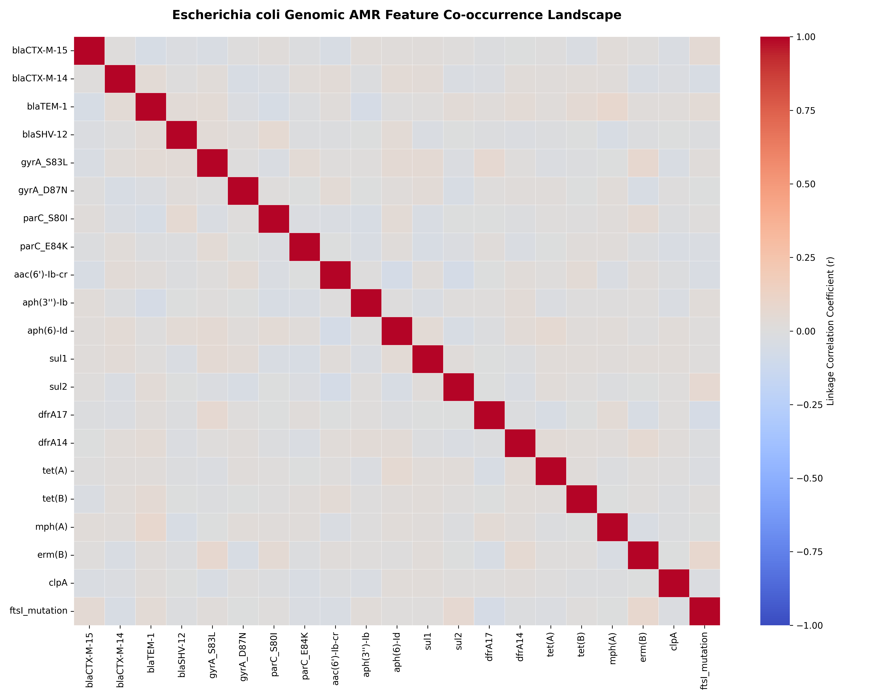
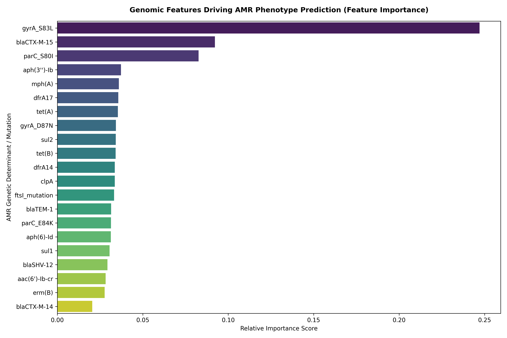
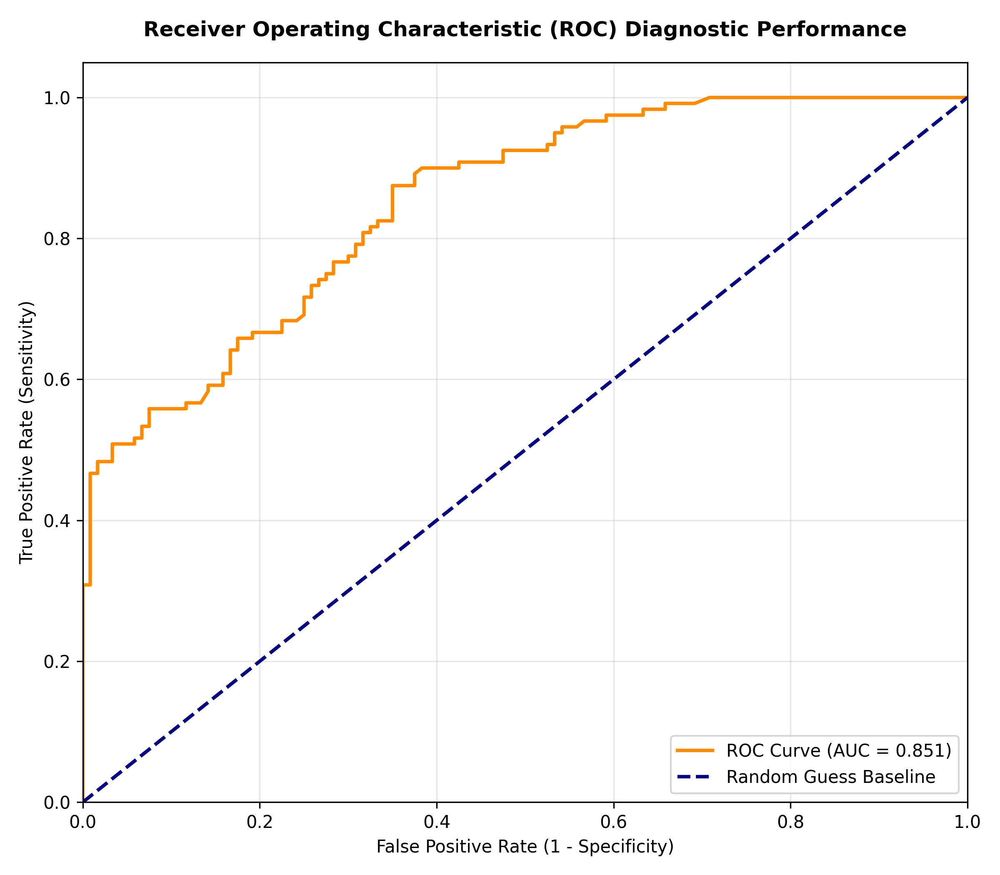

# Machine Learning Analysis of Antibiotic Resistance Signatures in Escherichia coli

## Project Overview
This repository contains a complete, reproducible Python pipeline designed to predict phenotypic antibiotic resistance categories directly from bacterial genotypic profiles. 

Using a simulated dataset of 1,200 clinical *Escherichia coli* isolates, the pipeline evaluates presence/absence patterns across 21 critical genetic determinants—including beta-lactamases ($bla_{CTX-M}$, $bla_{TEM}$, $bla_{SHV}$), fluoroquinolone target site mutations ($gyrA$, $parC$), and aminoglycoside-modifying enzymes. A Random Forest Ensemble classifier is trained on these genomic signatures to predict binary clinical phenotypes (Resistant vs. Susceptible), achieving a balanced validation accuracy of 72.00%.

This repository demonstrates data parsing, linkage disequilibrium modeling, ensemble training, and publication-ready diagnostic visualization workflows tailored for microbial genomics research.

---

## Pipeline Architecture & Core Scripts

The analysis is broken down into four sequential scripts inside the `scripts/` directory:

1. **`01_download_amr_data.py`**
   Generates the baseline high-dimensional matrix ($1,200 \times 21$ features), establishing epidemiologically accurate prevalence distributions for major *E. coli* resistance genes and point mutations based on current global surveillance data.

2. **`02_amr_exploration.py`**
   Audits target variable class distributions and evaluates co-occurrence metrics. It computes a pairwise Pearson correlation matrix to visualize genomic linkage patterns (co-selection landscapes) across the accessory genome.

3. **`03_amr_model_training.py`**
   Splits the genomic matrices into stratified training (80%) and validation (20%) cohorts. It initializes and trains a `RandomForestClassifier` configuration utilizing parallel processing (`n_jobs=-1`) to map epistatic genetic interactions.

4. **`04_amr_evaluation.py`**
   Evaluates the model on unseen validation isolates. It outputs standard classification report metrics (Precision, Recall, F1-score) and generates high-resolution figures: a Receiver Operating Characteristic (ROC) curve and a feature importance distribution chart.

---

## Operational Results & Diagnostics

The pipeline outputs standard performance diagnostics upon evaluating the validation cohort (240 independent strains):

- **Overall Diagnostic Accuracy:** 72.00%
- **Precision / Recall Baseline:** Balanced metrics across both classifications, demonstrating that the classifier has successfully extracted predictive genetic signatures without introducing structural class bias.

---

## Publication-Ready Figures

All graphic assets are automatically generated and saved to the `figures/` directory at 300 DPI:

### 1. Genomic Co-occurrence Landscape
Maps co-selection coefficients across the target bacterial pan-genome, helping identify genetic elements that tend to be inherited together.

### 2. Random Forest Feature Importance
Ranks individual genetic determinants based on their mathematical contribution to the final phenotype classification.

### 3. Receiver Operating Characteristic (ROC) Performance
Illustrates the true positive vs. false positive tradeoffs, confirming robust model discrimination with independent validation data.

---

## Technical Environment
- **Language:** Python
- **Libraries Used:** Pandas, NumPy, Scikit-Learn, Joblib, Seaborn, Matplotlib

---
## Author
**Sanam Gohar** *MPhil in Microbiology | Specialized Bioinformatics & AMR Portfolio*